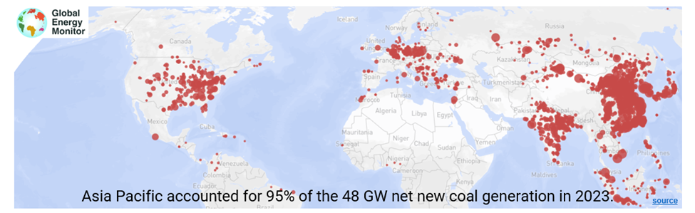

# Introduction

Amidst the escalating global focus on sustainability, the need for data-driven procurement in the energy sector has reached a critical point. In response, the Clean Incentive introduced the Granular Registry and its methodology. This registry, which promotes transparency, accuracy, and impact, significantly improves the existing Energy Attribute Certificates (EACs) system, ushering in a new era of more impactful climate action.

As adopting carbon-free energy (CFE) gains momentum, a new challenge emerges: ensuring that new CFE projects significantly reduce carbon emissions. While traditional EACs have been effective, they don't fully incentivize and reward the most impactful projects. This is where Granular Certificates (GCs) come in, offering a solution to this crucial problem.

To meet this challenge, industry leaders formed the Granular Registry Advisory Board (GRAB) to create an EAC enhancement methodology. GCs are not just a data layer on top of traditional EAC registries, but GCs also address a weakness in corporate energy procurement. They can help identify and prioritize investments with greater carbon impact. Using an open-source methodology, GCs assign carbon and air pollutant impacts to traditional EACs, considering the time and location of CFE generation on the grid in historical retrospect​​. It offers the ability to make procurement decisions that drive more significant climate impact as companies pursue their clean energy goals.

**Today, EACs are limiting grid decarbonization.**

EACs primarily focus on the quantity of CFE generated in megawatt-hours rather than the environmental impact, limiting their ability to estimate the impact on carbon and air pollutant emissions. Not all CFE has the same climate benefit. The GC Registry aims to address these limitations with a more accurate assessment based on the time and location of generation.

Current GHG accounting and reporting rules allow companies to purchase EACs to claim they are using green energy without substantially changing the emissions associated with their energy consumption or achieving significant emissions reductions to the atmosphere. This undermines the integrity of sustainability claims and can erode public trust in corporate environmental initiatives. Furthermore, traditional EACs do not incentivize high-impact projects, slowing down decarbonization and equity efforts by failing to drive demand toward the most effective emissions reduction and social impact projects.

<figure><figcaption></figcaption></figure>

## Missing Data Granularity of EACs

This lack of granularity has tangible implications, as EACs do not accurately reflect the carbon and air pollutant intensity of the marginal resource on the grid displaced by CFE generation. This means that the environmental impact of generation is not accurately represented, potentially leading to a skewed perception of an organization's actual carbon impact.

* **Hour of Generation:** Traditional EACs are typically issued based on the total amount of renewable energy produced over a month, quarter, or year without considering the exact hour this energy was generated. This approach overlooks the fact that the grid's carbon and air pollutant intensity varies throughout the day.
* **Location of Generation:** The location of CFE generation also plays a crucial role in its impact on emissions. CFE generated in regions with high carbon intensity (primarily relying on fossil fuels) results in greater emissions reductions than in regions with low carbon intensity. Furthermore, reducing air pollutant emissions upwind of densely populated areas drives much greater public health benefits.

## **Disconnect Between Energy Generation and Carbon Impact**

The current EAC systems focus solely on the amount of renewable energy produced, not the impact of the renewable energy impact on grid emissions. Renewable energy's carbon and air pollutant abatement depends significantly on grid conditions, varying hour by hour and location. This leads to meaningful over- (or under-) estimations of the impact of renewable energy procurement on an organization’s carbon footprint and undermines the credibility and effectiveness of carbon reduction efforts.

The current EAC market can lead to economic inefficiencies, market distortions, and operational challenges for grid operators by not accounting for carbon impact. CFE projects in areas with low marginal emissions receive the same recognition as those with a higher potential for carbon abatement. This is illustrated in the two regions shown, where Region 1 has lower Locational Marginal Emission (LME) values than Region 2.

<figure><figcaption></figcaption></figure>

<figure><figcaption></figcaption></figure>

## Transmission Congestion

The value of EACs also diminishes in regions where transmission constraints or low power prices prevail. In areas with transmission congestion, additional renewable energy generated cannot be effectively transmitted to where it is needed most, often resulting in curtailment.

Similarly, EACs produced in regions experiencing an oversupply of renewable energy sometimes fail to contribute meaningfully to additional carbon and air pollutant emission reductions. These conditions typically indicate that the marginal generator on the grid is already a low- or zero-emissions source, implying that new renewable energy projects do not displace higher-emitting fossil generation but rather add to the surplus of clean energy.

<figure><figcaption></figcaption></figure>

## The Shared Atmosphere: A Unifying Factor for Global EAC Registries

The current EAC and GO landscape is characterized by many separate registries worldwide.  Currently, 40+ EAC or Guaranty of Origin (GO) registries globally have not yet developed standards to integrate emissions impact. Unified standards are unlikely to develop in this fragmented landscape in the near term.

This fragmentation presents a significant challenge for organizations seeking to procure CFE across regions and prioritize carbon impact. It also hinders the transparency and traceability of renewable energy transactions, making it challenging to ensure the integrity of EACs and the associated claims.

<figure><figcaption></figcaption></figure>

The sharing of a single atmosphere further supports the concept of a global registry. Regardless of where they originate, greenhouse gas emissions contribute to global climate change. Therefore, reducing emissions anywhere in the world has a global impact. Furthermore, it is estimated that the particulate matter emissions from burning fossil fuels are causing 8.7 million deaths per year globally, with 355,000 of those deaths happening in the United States. The global registry directly links clean energy and battery procurement with global climate and sustainability action by including carbon impact. This global perspective aligns clean energy developers with the global climate action goal, helping prioritize project development in the regions with high abatement potential.

<figure><figcaption></figcaption></figure>
