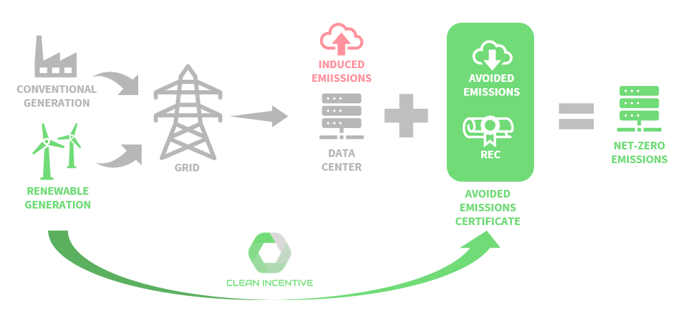

# Copy of What are Power Emissions Certificates?

Power Emissions Certificates (PECs) represent a novel approach to quantifying and valuing the environmental impact of renewable energy generation. Unlike traditional Renewable Energy Certificates (RECs) that focus solely on the renewable attribute of electricity generation, PECs account for the actual greenhouse gas emissions avoided due to the operation of renewable energy projects.

Each PEC represents the environmental attributes of one megawatt-hour (MWh) of renewable energy generation, including the amount of carbon emissions avoided. This is calculated based on the concept of Locational Marginal Emissions (LMEs), which provide a granular, time- and location-specific measure of the carbon intensity of electricity. LMEs are calculated based on the marginal operating emissions rate of the grid, which is the emissions rate of the next unit of electricity that would be produced or avoided if demand were to increase or decrease.

The creation of PECs involves the conversion of traditional RECs into a new form of a certificate that captures the emissions displacement achieved by renewable energy projects. This conversion process involves the retirement of the original RECs to avoid double counting environmental benefits and issuing new PECs based on the calculated avoided emissions.

<figure><figcaption></figcaption></figure>

PECs provide a more accurate and meaningful measure of the environmental impact of renewable energy generation. They enable renewable energy producers to certify the environmental benefits of their energy production and provide consumers with a reliable means of reducing the climate impact of their energy consumption. By assigning value to the avoided emissions, PECs also create a market incentive for renewable energy projects that achieve higher emissions reductions.

The use of PECs is facilitated by a global registry, which provides a platform for issuing, transferring, and retiring PECs. This registry ensures the transparency, traceability, and integrity of PEC transactions, enhancing the credibility of the associated environmental claims. The registry also integrates with existing REC registries and tracking systems, allowing seamless coordination between market instruments.

PECs represent a significant advancement in environmental market instruments. They provide a more comprehensive solution for tracking and monetizing the environmental benefits of renewable energy generation.

## Benefits of PECs

| **Transparency**                             | The registry discloses the methodology behind emissions measurement, verification, and reporting, providing certificate holders with traceability to the LCA. |
| -------------------------------------------- | ------------------------------------------------------------------------------------------------------------------------------------------------------------- |
| **Monetization of Emissions Reduction**      | Low-carbon suppliers can generate additional revenue and expand market share with PECs.                                                                       |
| **Market Mechanism for Emissions Reduction** | Trading PECs incentivizes emissions reduction through supply and demand.                                                                                      |
| **Consumer Choice**                          | Verified data is required for consumers to pay a "green premium" as corporate self-reporting is unreliable.                                                   |
| **Innovation Driver**                        | Lowering the industry average emissions factor over time through PECs drives decarbonization and creates demand for more impactful projects.                  |
| **Enhanced Credibility**                     | An independent registry enhances the credibility of the corporation’s reduction claims.                                                                       |
| **Competitive Advantage**                    | Being an early adopter of PECs can provide a significant advantage to businesses in terms of how they are perceived in the market.                            |
| **Supply Chain Optimization**                | Sharing emissions data with upstream and downstream partners can lead to more coordinated efforts to reduce emissions across the supply chain.                |

## Conversion RECs to PECs

The solution to this challenge is converting EACs to Power Emissions Certificates (PECs). PECs, denominated in tons of carbon dioxide avoided, provide a common metric that transcends regional boundaries and directly aligns with the broader goal of mitigating climate change. This conversion simplifies procuring and trading renewable energy certificates and enhances their environmental significance.

With the conversion to PECs, the creation of a global registry becomes not only possible but also highly beneficial. A global registry would consolidate the various separate registries into a single, unified platform. This would significantly simplify procuring and trading PECs, making it easier for organizations to source renewable energy worldwide. It would also enhance the transparency and traceability of renewable energy transactions, ensuring the integrity of PECs and the associated claims.

To avoid double counting and ensure the unique value of PECs, the RECs associated with renewable energy generation will be retired in the PEC registry before issuing PECs. This approach would prevent both instruments from claiming the same environmental benefits and ensure that each certificate represents a distinct attribute of renewable energy generation.

<figure><figcaption></figcaption></figure>

| Feature             | Traditional RECs                                                                                                                                             | PECs                                                                                                                                                              |
| ------------------- | ------------------------------------------------------------------------------------------------------------------------------------------------------------ | ----------------------------------------------------------------------------------------------------------------------------------------------------------------- |
| Transaction Process | Purchased OTC via brokers requiring complex and lengthy contract negotiations, via multiple intermediaries and iterations                                    | Purchased on one global digital marketplace for ease of use                                                                                                       |
| User Experience     | RECs are only available via analogue UX systems that are opaque, cumbersome and outdated for digital natives (more like Web1 than Web3)                      | The marketplace is completely digital in nature and has been created to be transparent and easy to use.                                                           |
| Issuance            | Layers of centralized bureaucracy, regional restrictions, and compliance processes lead to delays                                                            | Projects receive PECs automatically upon verification through public blockchain traceability.                                                                     |
| Transparency        | RECs are transacted on private registries with no interoperability or public ledger access, meaning the risk of double counting via other registries is high | All transactions are publicly listed on our marketplace for full transparency, and digital certificates are issued upon retirement with full proof of provenance. |

<figure><figcaption></figcaption></figure>
