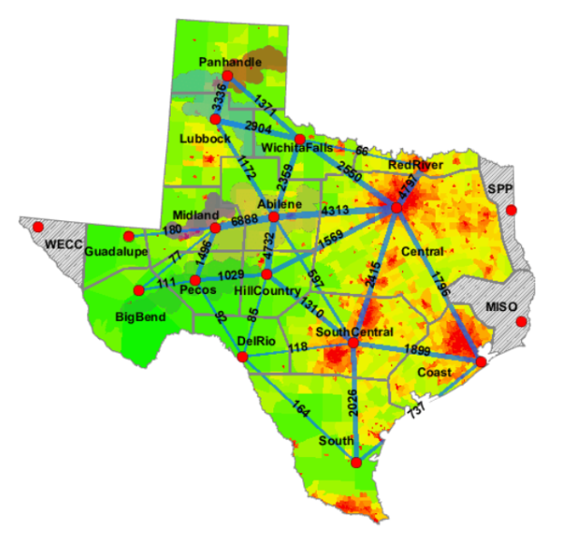
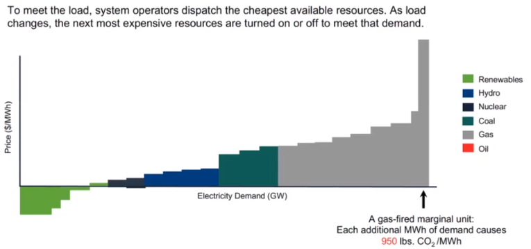

# What are Power Grid Marginal Emissions?

Marginal emissions refer to the amount of additional greenhouse gas (GHG) emissions generated from an increase in electricity demand or, conversely, the amount of emissions avoided due to a decrease in demand. They are critical in understanding and quantifying the environmental impact of electricity generation and consumption on an incremental basis.

These estimates are a critical component of the PEC platform, providing a granular, time- and location-specific measure of the carbon intensity of electricity.&#x20;

<figure><figcaption></figcaption></figure>

<figure><figcaption></figcaption></figure>

## **Calculation of Marginal Emissions**

The calculation of marginal emissions is complex and depends on various factors, including the type of energy sources available, their emission rates, and the demand for electricity. Here’s an overview of how they are calculated:

1. **Assessment of the Energy Mix**: The first step involves assessing the current mix of energy sources feeding into the grid. This includes renewable sources like wind and solar, as well as fossil fuels such as coal and natural gas.
2. **Determination of the Marginal Source**: The next step is to identify the ‘marginal’ source of energy. This is the source that would be used to meet an additional unit of electricity demand or the first to be reduced when demand decreases.
3. **Emission Rates of the Marginal Source**: Once the marginal source is identified, the associated emission rate of that source is calculated. This rate indicates the GHG emissions per unit of electricity generated.
4. **Dynamic Calculation**: As the energy mix and demand patterns fluctuate, the marginal source and its emissions rate can change, making this a dynamic calculation that can vary by time of day and geographic location.

The calculation of LMEs requires detailed data on the operating characteristics of power plants, the transmission grid, and the electricity demand. This includes data on the emissions rates of different types of power plants, the location and capacity of power plants, the transmission constraints of the grid, and the temporal and spatial patterns of electricity demand.

<figure><figcaption>
Source: WattTime.org
</figcaption></figure>

### **Different Names and Concepts**

* **Locational Marginal Emissions (LMEs)**: This term refers to the marginal emissions calculated specifically for a particular node location on the grid. LMEs are crucial in regions where the energy mix varies significantly or with severe transmission constraints, as they provide a more accurate measure of the emissions impact of electricity consumption or generation in that specific area.
* **Short-Run Marginal Operating Rates**: These rates are used to determine the emissions impact in the short term. They are based on the operating characteristics of power plants that are online and can ramp up or down to meet immediate changes in electricity demand.
* **Long-Run Marginal Emissions**: In contrast, long-run marginal emissions consider larger and longer-term changes in electricity demand or supply, incorporating factors like the construction of new power plants or the retirement of old ones.

<figure><figcaption></figcaption></figure>

## Short run versus long run

#### **Short-Run Marginal Emissions**

1. **Definition**: Short-run marginal emissions (SRMEs) refer to the incremental emissions resulting from an immediate increase or decrease in electricity demand. They are calculated based on the operating characteristics of the power plants that are currently online and can adjust their output to meet real-time changes in demand.
2. **Key Characteristics**:
   * **Responsiveness**: SRMEs are highly responsive to real-time changes in electricity demand and supply.
   * **Calculation Basis**: The calculation typically involves the emissions rate of the 'next' power plant that would be brought online (or taken offline) to meet changes in demand.
   * **Time Sensitivity**: These emissions rates can change throughout the day, influenced by factors like fluctuating demand, availability of renewable resources (e.g., sunlight for solar power), and the operational status of various power plants.
3. **Usage**: SRMEs are particularly relevant for operational decision-making, such as demand-side management, where immediate actions can be taken to utilize cleaner energy sources or reduce consumption during periods of high emissions intensity.

#### **Long-Run Marginal Emissions**

1. **Definition**: Long-run marginal emissions (LRMEs) are concerned with the emissions impact of larger, longer-term changes in the electricity grid. They reflect the emissions associated with significant alterations in the grid's generation capacity, such as the addition of new power plants or retirement of existing ones.
2. **Key Characteristics**:
   * **Future Projection**: LRMEs are based on anticipated changes in the electricity generation mix and the expected operational lifespan of different types of power plants.
   * **Policy and Investment Influences**: These emissions are significantly influenced by energy policies, market trends, and investments in new technologies and infrastructure.
   * **Long-Term Planning**: They are essential for strategic planning, policy-making, and investment decisions in the energy sector.
3. **Usage**: LRMEs are crucial for long-term planning and policy development, helping to shape decisions on future energy infrastructure and investments in renewable energy projects.

### **Why Short-Run Marginal Emissions are Preferred for Carbon Inventory**

1. **Real-Time Impact**: SRMEs provide a more immediate and accurate reflection of the environmental impact of electricity generation and consumption. They align with the real-time nature of electricity grids and can reflect the actual carbon footprint of electricity use at any given moment.
2. **Relevance to Grid Operations**: The dynamic nature of SRMEs makes them highly relevant to grid operations and management. They allow for more precise tracking of the environmental impact of electricity consumption and generation, especially in systems with significant renewable energy penetration.
3. **PECs Alignment**: PECs are designed to incentivize real-time reductions in GHG emissions. SRMEs align perfectly with this objective, as they offer a clear and immediate measure of the emissions impact of consuming or avoiding one additional unit of electricity. This makes them an ideal metric for quantifying the environmental benefits represented by PECs.
4. **Facilitates Immediate Action**: By providing a real-time view of emissions, SRMEs enable consumers and producers to make immediate adjustments to their energy usage or production strategies, leading to more effective carbon management and reduction strategies.
5. **Compliance and Reporting**: For carbon inventory purposes, especially under frameworks that require timely and accurate reporting of emissions, SRMEs offer the precision and responsiveness necessary for compliance and transparency.

## Benefits

| Real-time Carbon Impact Assessment | 
SRME provides a real-time or near-real-time assessment of the carbon impact of electricity generation. This allows corporate buyers to have a more accurate and timely understanding of their carbon footprint.

 
                   |
| ---------------------------------- | ------------------------------------------------------------------------------------------------------------------------------------------------------------------------------------------------------------------------------------------------ |
| Granularity                        | SRME offers a granular view of emissions, often on an hourly basis. This granularity can help corporate buyers understand the specific times of day or seasons when their renewable PPAs are most effective in reducing emissions.               |
| Informed Decision Making           | By understanding the SRME, corporate buyers can make informed decisions about when to consume power (e.g., shifting demand to times when SRME is low) and how to structure their renewable PPAs.                                                 |
| Enhanced Credibility               | 
Using SRMEs can enhance the credibility of a corporate buyer's sustainability claims. It demonstrates a commitment to understanding and reducing real-world emissions impacts rather than just relying on average emissions data.

 
 |
| Dynamic Pricing Opportunities      | If electricity prices are linked to SRME values, corporate buyers can potentially benefit from dynamic pricing opportunities, consuming more power when SRME (and potentially prices) are low.                                                   |

&#x20;

## Challenges

| Complexity                                | SRME values can be complex to calculate and require detailed data on the grid's energy mix, demand patterns, and other factors. This might pose challenges for corporate buyers without the necessary expertise.        |
| ----------------------------------------- | ----------------------------------------------------------------------------------------------------------------------------------------------------------------------------------------------------------------------- |
| Intermittency of Renewables               | The intermittent nature of many renewable sources can lead to fluctuations in SRME. This can make it challenging for corporate buyers to consistently match their consumption with low SRME values.                     |
| Transmission and Distribution Constraints | Even if a corporate buyer has a renewable PPA in place, transmission or distribution constraints might mean that the renewable energy doesn't always reach the grid, affecting the SRME.                                |
| Potential for Misinterpretation           | Without proper context, SRME values can be misinterpreted. For instance, a high SRME value at a particular time doesn't necessarily mean the grid is "dirty"; it might just reflect temporary demand-supply imbalances. |
| Limitations in Scope                      | 
SRME primarily focuses on the carbon impact of electricity generation. It might not capture other environmental impacts associated with power production, such as water usage or habitat disruption.

 
     |
| Data Availability                         | Not all regions or grids might have readily available SRME data. This can pose challenges for corporate buyers operating in multiple jurisdictions.                                                                     |

&#x20;

## Resources






