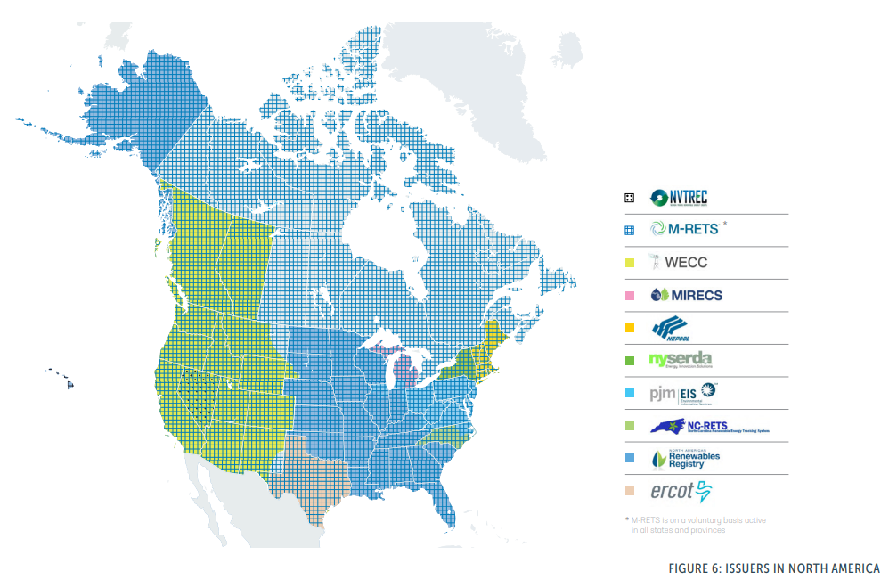
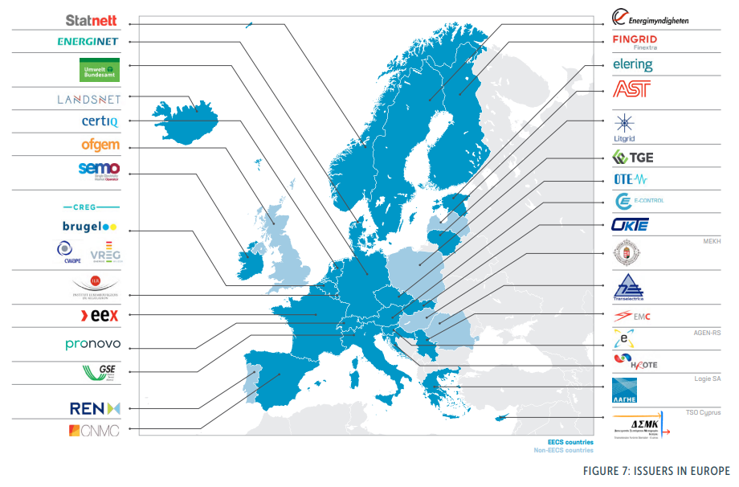
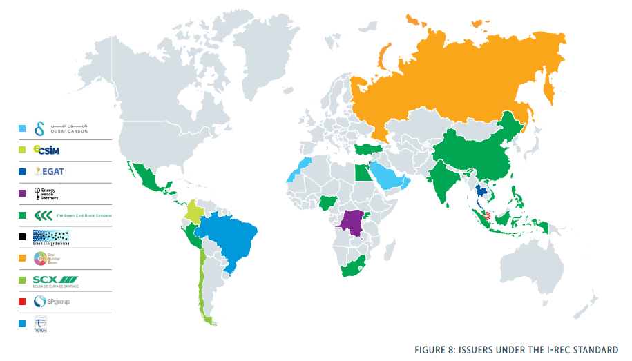
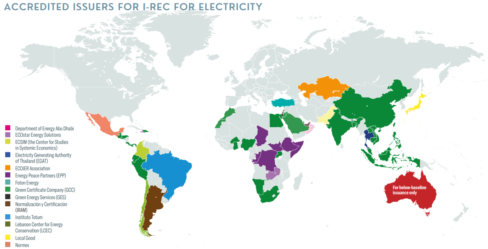

# What are RECs?

Understanding the nuances between attributional and consequential accounting is crucial for accurately reporting and interpreting the impact of renewable energy purchases and carbon offset projects within the GHG Protocol framework. RECs play a vital role in facilitating renewable energy adoption and Scope II emissions reporting. However, to drive meaningful reductions in global GHG emissions, it is essential to complement REC purchases with strategies that demonstrate real-world emission reductions, guided by the principles of consequential accounting. The GHG Protocol provides a robust framework for companies to navigate these complexities, supporting informed decision-making and effective climate action.

## Renewable Energy Credits (RECs) Explained

RECs serve as market-based instruments designed to promote the generation and use of renewable energy. Each REC represents proof that one megawatt-hour (MWh) of electricity has been generated from a renewable energy source, such as solar, wind, hydroelectric, or biomass, and injected into the shared system of power lines which transport electricity. While RECs signify the generation of renewable energy, they inherently do not ensure that the specific electricity consumed by the REC purchaser comes from a renewable source due to the interconnected nature of electricity grids. This separation of renewable energy attributes from the physical electricity allows RECs to be traded independently, providing flexibility in how entities claim renewable energy usage and manage their environmental impacts.




For more information, see the EPA page for [Renewable Energy Certificates (RECs)](https://www.epa.gov/green-power-markets/renewable-energy-certificates-recs#two)


