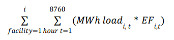
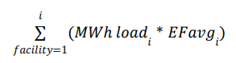
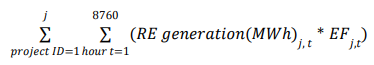
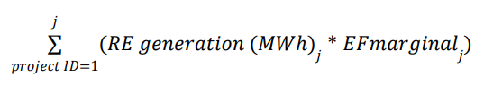

# What is Emissions Matching?

The GC registry enables an innovative approach to carbon accounting known as carbon matching or impact-based carbon accounting. This method determines the carbon emissions based on the impact approach detailed previously. This method also follows the guidelines of the EmissionsFirst Partnership, which proposes updating the protocol with a new scope 2 emissions calculation approach that considers the impact of location and temporality as key factors for achieving grid decarbonization.

Carbon matching involves matching the emissions induced by a load with the emissions avoided by a renewable energy project. This is ideally done hourly, considering the location and timing of generation and consumption. The net emissions are then calculated as the difference between the induced emissions of the load and the emissions avoided by the renewable energy project.

<figure><figcaption></figcaption></figure>

<figure><figcaption></figcaption></figure>

The key steps in this process are as follows:

1. **Calculate Induced Emissions:** as described in the previous section, based on the load's consumption data and the corresponding Locational Marginal Emissions (LME) data.
2. **Calculate Avoided Emissions:** similarly, based on the renewable project's generation data and the corresponding LME data.
3. **Perform Carbon Matching:** the induced emissions of the load and the avoided emissions of the renewable energy project are matched, ideally on an hourly basis or within the analyzed period.
4. **Calculate Net Emissions:** The net emissions for the load are calculated by summing the net emissions for all analyzed hours or periods. This provides a measure of the total emissions impact of the load's energy consumption, taking into account the emissions avoided by purchasing renewable energy.

Under the impact-based approach, the timing and location of generation or consumption are critical. The precision of the carbon balance will depend on the data available regarding when and where grid electricity is consumed, as well as the renewable energy generated and injected into the grid.

Induced emissions represent the amount of greenhouse gas emissions produced due to the energy consumption of a load, and avoided emissions represent the amount of greenhouse gas emissions that are prevented from being released into the atmosphere due to the operation of renewable energy projects.

The calculation of induced and avoided emissions is based on the concept of Locational Marginal Emissions (LME), which provides an estimate of the emissions associated with each unit of energy consumed, as well as those that would have occurred if the renewable energy project were not in operation.

Using hourly data provides a more robust method for estimating emissions. However, in many places, there is still no reliable telemetry system to obtain this information, and in such cases, calculations must be made based on average values for a specific period. The table below summarizes the equations included in the emissions calculation.

|                                                               | **HOURLY DATA**                                                                                    | **MONTHLY OR ANNUAL DATA**                                                                           |
| ------------------------------------------------------------- | -------------------------------------------------------------------------------------------------- | ---------------------------------------------------------------------------------------------------- |
| **Impact-based Carbon Accounting**                            | 
The consumed () or generated electricity () is affected by the hourly LME rate

( , ).
 | he consumed () or generated electricity () is affected by the average LME rate for the period ( , ). |
| 
<strong>Induced</strong> <strong>Emissions</strong>
 |                                    |                                      |
| **Avoided emissions**                                         |                                    |                                      |
