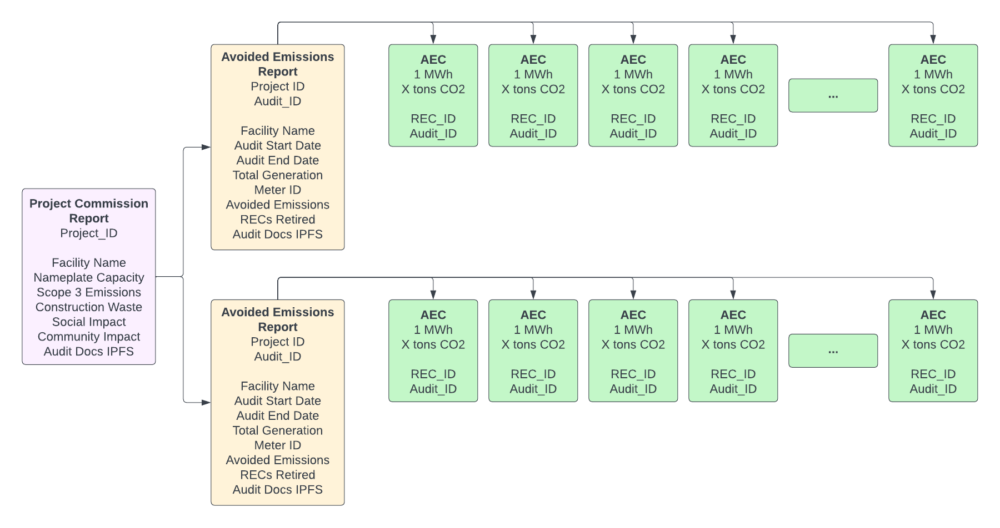

# Generation

## **Standardized Reporting Format**

Develop a standardized reporting format that details all relevant information, including operational data of the battery, emission reductions achieved, and methodologies used for calculations.

PECs have unique identification data coded into them, and supplementary data is accessible through the registry. This includes:

* Source of electricity
* Retired REC IDs (if applicable)
* Date when the MWh was produced
* Identity, location (GPS reference), and country of provenance
* Type and capacity of the production facility
* Whether and to what extent the installation has benefited from outside support
* Date when the installation became operational

## Project Impact Report

This project impact report is crucial to the PEC framework. It provides a comprehensive overview of a renewable energy project's climate, community, and conservation attributes. This report is essential because it allows potential buyers of PECs to understand the broader impacts of the projects they support beyond just the avoided emissions.

<figure><figcaption></figcaption></figure>

The report can include a wide range of information about the project's development and construction methods. For example, it can detail how the project was planned and executed, the technologies used, the materials sourced, and the waste management practices implemented. This information can provide a clear picture of the project's environmental footprint, a key consideration for many PEC buyers.

In addition to environmental aspects, the report can also cover social aspects of the project. This can include information about community participation in the project, the project's impact on local employment, and any community development initiatives associated with the project. This information can be particularly valuable for PEC buyers interested in supporting projects contributing to social development and community wellbeing.

The report can also include information about the project's governance practices. This can cover topics such as the project's compliance with regulations, engagement with stakeholders, and management of risks. This information can assure PEC buyers that the project is managed responsibly and ethically.

The sustainability report can also include a detailed account of the project's Scope 1, 2, and 3 emissions. Scope 1 emissions are direct emissions from owned or controlled sources. Scope 2 emissions are indirect emissions from the generation of purchased energy. Scope 3 emissions are all indirect emissions (not included in scope 2) that occur in the value chain of the reporting company, including both upstream and downstream emissions. This comprehensive emissions accounting can provide a clear picture of the project's overall carbon footprint, which can be a key consideration for PEC buyers.

Tracing all PECs back to a project sustainability report that catalogs these aspects of the project's development and construction methods adds a layer of transparency and accountability to the PEC framework. It allows potential buyers to decide which projects to support based on their values and priorities. As the report outlines, some customers may be willing to pay more for PECs from projects that align with their values.

This concept is similar to the Green-e certification for RECs, which provides independent, third-party certification to ensure that RECs meet strict environmental and consumer protection standards. Like Green-e certification, the Project Sustainability Report can assure PEC buyers that the projects they support meet high environmental and social responsibility standards.
