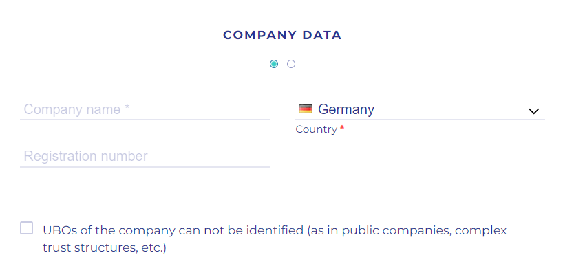

# User Identification

All Company Representatives must go through the registry's Know Your Customer (KYC) process. The initial Company Representative must also provide some basic information about their company in the Know Your Business (KYB) process. Both processes are handled by a professional identity verification service by our partner Sumsub [https://sumsub.com/](https://sumsub.com/).

Users who go through the KYC or KYB processes will receive an email containing a link to Sumsub, after the initial registration on the platform has been submitted and approved by the registry administrator.

Each process should take less than 5 minutes to complete.

## KYB 

To complete the KYB process you will need to confirm your email and fill in the company's:

1. Name
2. Country of registration
3.  Registration number

    * We recommend US-based companies to provide their employer identification number (EIN) assigned by the IRS

    <figure><figcaption></figcaption></figure>
4. You can perform this on your phone by clicking on the "Continue on phone" link.

## KYC 

The KYC process requires you to provide some basic information about yourself along with photographs of a government issued ID, and to perform a "liveness check" using a webcam on your laptop or phone. Here are the steps:

1. Fill out your first and last names
2. Click start verification now
3. Choose either 'USA' or 'other countries' as your country residence
4. Select which type of government-issued ID you will upload to the site:
   1. ID Card
   2. Passport
   3. Residence Permit
   4. Driver's license
5. Click "I'm ready" and follow the on-screen instructions to complete the live verification step.

<figure><figcaption></figcaption></figure>

<figure><figcaption></figcaption></figure>


You can choose to do the process on the phone if your computer does not have a webcam or if it's much easier to upload the documents.


<figure><figcaption></figcaption></figure>


It takes at least 24 hours to process the verification and make the final approvals for your registration on the platform.

